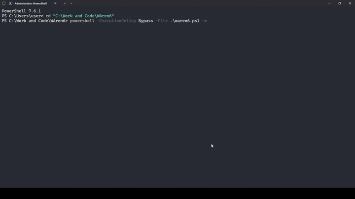

<h1> WAren6</h1>

WAren6 [**W**hats**A**pp+Fo**ren**sics(**6**)] is a Windows toolkit for WhatsApp Desktop forensic extraction and review. It copies WhatsApp Desktop AppData folders to the directory you ran the script, decrypts WhatsApp SQLite databases and WAL files, reads WebView2 IndexedDB, and builds `unified_whatsapp.db`, which can be opened and analyzed by my WAren6 Reader (WhatsApp-like GUI) or DB Browser.

## Product Walkthrough

[](assets/waren6-showcase.gif)

This walkthrough shows the WAren6 extraction flow, generated case output, `unified_whatsapp.db`, and WAren6 Reader review experience using a staged demonstration database with synthetic WhatsApp data. Please note the GUI can look shit over here, as it's in gif format (which only supports 256 color combinations).

## NOTE!!!

* I used OpenAI Codex to improve documentations and code readability.
* Since this project is relatively new, it can lack some features or have some bugs please let me know in the issues section or you can fix it yourself too and open a pull request.

## Download

Users should download the release packages from the [WAren6 releases page](https://github.com/MayukXT/WAren6/releases).

- [WAren6 Field Kit v1.1.0](https://github.com/MayukXT/WAren6/releases/tag/fieldkit-v1.1.0): download `WAren6-FieldKit-v1.1.0.zip`.
- [WAren6 Reader v1.7.0](https://github.com/MayukXT/WAren6/releases/tag/reader-v1.7.0): download the desktop Reader installer (recommended) or portable EXE for opening `unified_whatsapp.db`. Please also note [this](#MSSS).

The field kit is the end-user package. It contains the PowerShell/Python scripts, required dependency files, offline install helpers, and wheels when prepared. It intentionally excludes source code and other dev files and folders.

## Main Features

The main idea is simple: WAren6 is not only a decrypt script. It tries to make the whole WhatsApp Desktop extraction and review process usable from start to finish.

- It copies WhatsApp Desktop evidence, decrypts SQLite databases and WAL files, reads **WebView2 IndexedDB/Store 8** data, and builds one `unified_whatsapp.db`.
- It can use the live WhatsApp runtime as a supplement when that is allowed (enabled by default), so newer Store 8 messages can be extracted and decrypted. (This is a new technique and is useful for new versions of whatsapp)
- It keeps missing, deleted, encrypted, media-only, and system rows visible instead of silently hiding them like WhatsApp Desktop Client does.
- It can copy/index/hash local media already present on disk when `-m` is used. It does not magically download missing media. (I am researching on how can we extract the media that are not present locally)
- It writes logs, manifests, validation data, archives, and hashes so the output is easier to verify later.
- It has an optional **Telegram bot transfer mode** for sending the verified archive/parts to another chat or device.
- Telegram transfer can also encrypt the archive with `-enc`, and `-ad` can delete only WAren6-generated local output after verified upload.
- It supports offline and air-gapped work with copied `LocalState`, offline wheels, and the `WAren6_unify_later.txt` fallback if Python is not available on the evidence machine.
- The Reader gives a WhatsApp-like way to view chats, contacts, calls, media, search, jump-to-message results, reactions, edited-message evidence, albums, and local HTML export.

## Quick Start

- Download the [`WAren6-FieldKit-v1.1.0.zip`](https://github.com/MayukXT/WAren6/releases/tag/fieldkit-v1.1.0)
- Extract `WAren6-FieldKit-v1.1.0.zip` to a simple folder:

```powershell
Expand-Archive .\WAren6-FieldKit-v1.1.0.zip -DestinationPath C:\Tools
cd C:\Tools\WAren6-FieldKit
```
**Run Terminal/PowerShell as Administrator.**

Run the preflight check:

```powershell
powershell -ExecutionPolicy Bypass -File .\waren6.ps1 -doc
```

Run the default extraction (no media):

```powershell
powershell -ExecutionPolicy Bypass -File .\waren6.ps1
```

Run the default extraction (with media):

```powershell
powershell -ExecutionPolicy Bypass -File .\waren6.ps1 -m
```

Run offline against copied WhatsApp AppData LocalState folder:

```powershell
powershell -ExecutionPolicy Bypass -File .\waren6.ps1 -f --no-net -w C:\Cases\CollectedLocalState -i <oduid-hex> -d C:\Cases\WAren6
```

Run default and use **Telegram Bot Server** to receive it in your bot chat:

```powershell
powershell -ExecutionPolicy Bypass -File .\waren6.ps1 -m -tg "BOT_TOKEN" -cid "CHAT_ID"
```

### For more detailed command usage [check this out](#ai-use)

---
<a name="MSSS"></a>
Open the resulting `unified_whatsapp.db` in WAren6 Reader.

For Windows, download either the [portable Reader EXE](https://github.com/MayukXT/WAren6/releases/tag/reader-v1.7.0) or the [installer](https://github.com/MayukXT/WAren6/releases/tag/reader-v1.7.0). If **Microsoft SmartScreen** warns, choose **More info** and **Run anyway** only after confirming the file came from the official release page. The warning is expected for unsigned binaries because Windows reputation requires a trusted code-signing certificate which costs $250+ p.a. which I can't afford...

## Requirements

- Windows with WhatsApp Desktop installed and the WhatsApp account logged in, or a copied WhatsApp Desktop `LocalState` folder. For copied evidence, run WAren6 on the same Windows machine/profile the folder came from, or provide the original ODUID with `-i`.
- Run Terminal/PowerShell as Administrator. WAren6 uses backup-mode file copy for locked WhatsApp evidence, and non-admin shells can miss or fail to copy files.
- PowerShell 5.1+ or PowerShell 7+.
- `BouncyCastle.Cryptography.dll` in the WAren6 folder.
- Python 3.10+ for unification and reports, unless using an offline/embedded Python package.
- `ccl_chromium_reader` for IndexedDB parsing.

NOTE: If Python is not available on the evidence machine, WAren6 can still acquire, decrypt, hash, manifest, and archive. It writes `WAren6_unify_later.txt` with the command needed to build `unified_whatsapp.db` later. Yeah this is a huge feature.

## Main Commands

| Command | Purpose |
| --- | --- |
| `.\waren6.ps1 --dry` | Print the planned operation and exit. |
| `.\waren6.ps1 -doc` | Run preflight checks only. |
| `.\waren6.ps1` | Default hybrid extraction and unification. |
| `.\waren6.ps1 -m` | Include local media copy/index/hash. |
| `.\waren6.ps1 -f --no-net` | Offline evidence-only run. |
| `.\waren6.ps1 -a` | Acquire, decrypt, manifest, hash, and archive only. |
| `.\waren6.ps1 -u -c <case-or-archive>` | Build `unified_whatsapp.db` from an existing case or archive. |
| `.\waren6.ps1 -r -c <folder>` | Capture only the live Store 8 runtime JSONL supplement. |
| `.\waren6.ps1 -m -tg "BOT_TOKEN" -cid "CHAT_ID"` | Run with media and send the verified archive/parts through a Telegram bot. |
| `.\waren6.ps1 -m -tg "BOT_TOKEN" -cid "CHAT_ID" -enc "PASS"` | Encrypt the archive before Telegram transfer. |
| `.\waren6.ps1 -m -tg "BOT_TOKEN" -cid "CHAT_ID" -ad -enc "PASS"` | Encrypted Telegram transfer and delete WAren6-generated local output only after verified upload. |
| `.\waren6.ps1 --get-id` | Print an ODUID SHA-256 fingerprint. Use `--show-secret-id` only if you really need the raw ODUID. |
| `.\waren6.ps1 --reports` | Also generate the larger human-readable reports folder. |
| `.\waren6.ps1 --help flags` | Show command help. |

Hybrid mode may need the logged-in WhatsApp runtime for best Store 8 recovery. WAren6 now starts/restarts that runtime in a best-effort hidden background state by default; use `--foreground-runtime` only for troubleshooting.

## Output

A normal completed case produces:

```text
WAren6_<timestamp>.tar.zst or WAren6_<timestamp>.zip
WAren6_<timestamp>.sha256.txt
WAren6_<timestamp>.manifest.json
WAren6_<timestamp>.logs.txt
```

The extracted `WAren6_<timestamp>` folder is cleaned after the archive is verified, because otherwise the output folder becomes too cluttered. If you want to keep the extracted folder too, run with `--keep-case-folder`.

Inside the archive you will find `unified_whatsapp.db`, `validation_report.json`, `WAren6.manifest.json`, `logs.txt`, and evidence/runtime folders when present. The larger `reports` folder is opt-in with `--reports`. WAren6 preserves provenance and validation data so recovered rows can be traced back to source artifacts. Missing or encrypted message bodies are kept visible instead of being silently dropped.

## Offline Field Kit (for Air-Gapped Machines)

On an internet-connected preparation machine:

```powershell
powershell -ExecutionPolicy Bypass -File .\airgap\prepare-wheels.ps1
powershell -ExecutionPolicy Bypass -File .\airgap\build-airgap-package.ps1 -Name WAren6-FieldKit-v1.1.0
```

On the offline machine:

```powershell
Expand-Archive .\WAren6-FieldKit-v1.1.0.zip -DestinationPath C:\Tools
cd C:\Tools\WAren6-FieldKit
powershell -ExecutionPolicy Bypass -File .\airgap\install-offline-deps.ps1
powershell -ExecutionPolicy Bypass -File .\waren6.ps1 -f --no-net -d C:\Cases\WAren6
```

## Reader

[WAren6 Reader](https://github.com/MayukXT/WAren6/releases/tag/reader-v1.7.0) is a local WhatsApp-like GUI desktop viewer for `unified_whatsapp.db`. It supports viewing chats, contacts, call history, media metadata or media (if they were present locally and `-m` was used during extraction), rich search, jump-to-message navigation, reactions, read receipts, edited-message evidence, grouped albums, and local chat HTML export.

Reader and Field Kit are released separately now, so one does not force the other to bump.

```powershell
reader-v1.7.0
fieldkit-v1.1.0
```

The `Reader Release` workflow builds the Reader installer, portable EXE, MSI, and updater metadata. The `Field Kit Release` workflow builds only the Field Kit zip and SHA-256 file.

## Release Automation

Releases are automated from explicit tags. This keeps normal README edits and unrelated source changes from doing expensive builds.

- `fieldkit-v1.1.0` publishes `WAren6-FieldKit-v1.1.0.zip` for users.
- `reader-v1.7.0` publishes the Windows Reader portable EXE and installer.

## Development

Run the Python tests:

```powershell
python -m unittest discover -s tests -p 'test*.py'
```

Run Reader checks:

```powershell
cd waren6-reader
npm test
npm run check:release-version -- --tag reader-v1.7.0
cd src-tauri
cargo test
```

## AI Use

For AI-assisted help, attach `LLM.txt` as the main context file. It contains WAren6 usage rules, command meanings, recovery notes, validation language, and troubleshooting guidance that are too detailed for this README.

### ~Thank You, have a great day!
